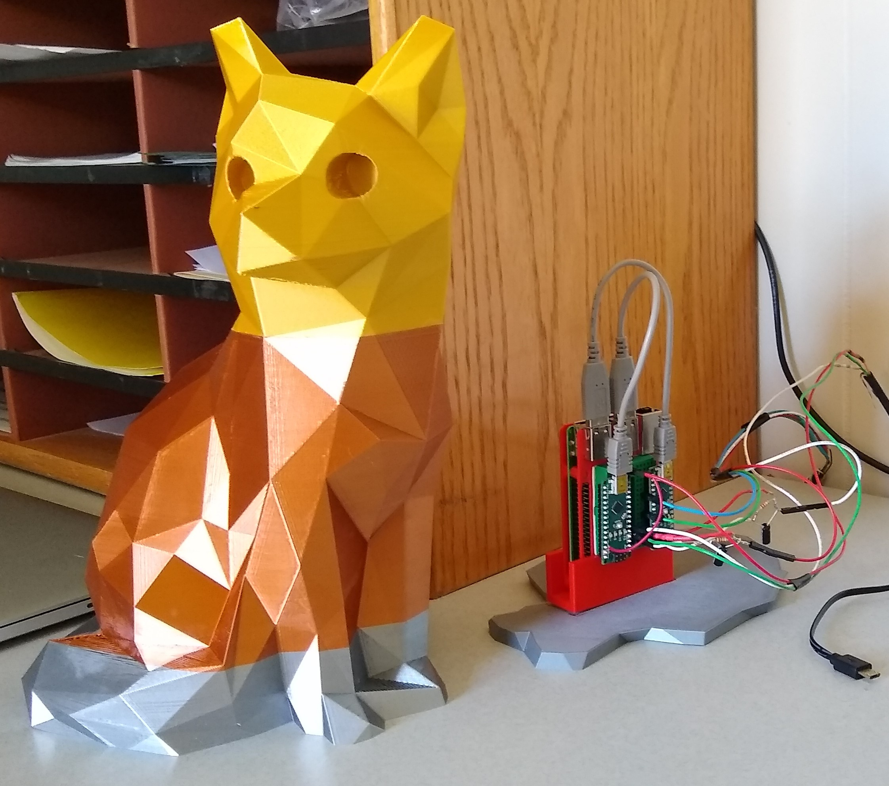
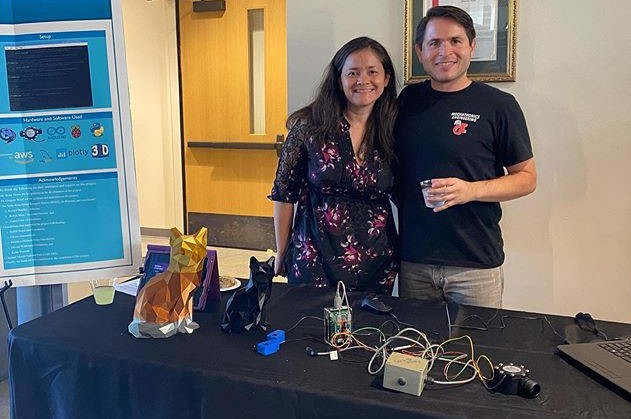
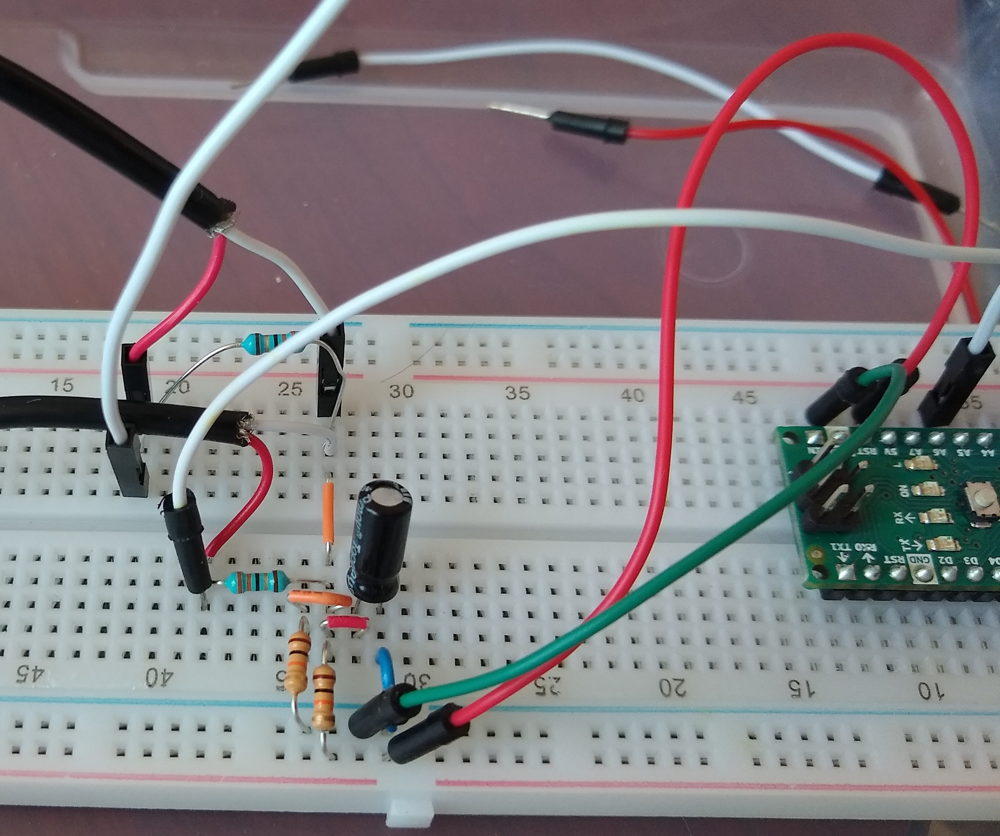
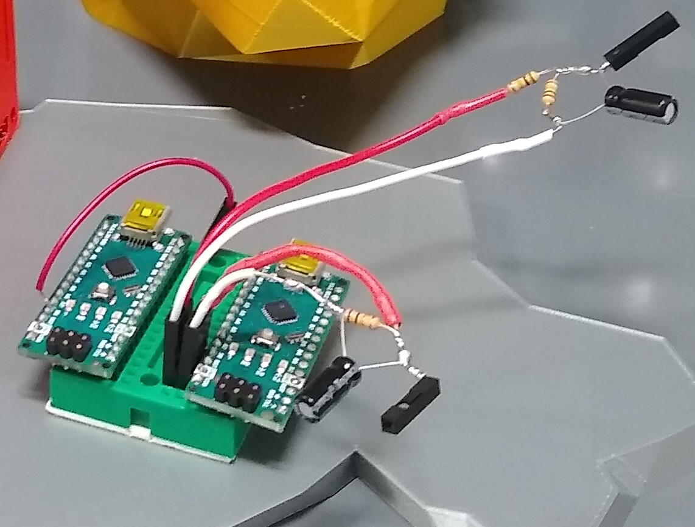

<p align="center">
  
</p>
<p align="center">
  
</p>

# Overview
This project was a combination Independent Study and Capstone project for undergrad Computer Science students at CSUCI. Not wanting to design another boring app, we decided to tackle a multidisciplinary problem. Santa Rosa Island, off the coast of Southern California, is home to CSUCI's research station. The climate on the island is charaterized by mild Winters and very dry Summers. Combined with severe drought during the past decade, resources on the island are very limited. This project serves a sustainability purpose by allowing research station staff monitor in real time the resource usage of the station. 

The project uses a Raspberry Pi as the main computer to read in electric and water usage, then uploads that data to an online database in the cloud. This data is now accessible on the mainland to be viewed graphically. Research station staff can now see how much and when resource usage happens and make sustainable decisions going forward. This project was then tidied up and placed into a 3D printed Island Fox, which is native to the island. 

### Authors
Ricky Medrano and Geraldine Salazar-Harms

<p align="center">
  
</p>

### Experience Gained ###
* Python
* Arduino (C++)
* Microcontrollers
 * Arduino Uno
 * Arduino Nano
 * Analog to Digital Converter (ADC)
 * Interrupts 
 * Digital and Analog pin inputs and outputs
 * Power requirements via 5V Logic
* Electrical parameters - voltage, amperage, mains electricity
* alskdj
### Program and Code Prerequisites
- Python 3 with mysql connector library
- Arduino IDE with EmonLib library
- Raspbian (any version with systemd, so Stretch or Buster)
- MySQL database, either locally or in the cloud. We used a MySQL RDS on AWS with their free-tier option. 
- If you want to graph the data you can use a website like Grafana and connect your database, or you can use Plotly's Chart-Studio.
- VNC on Raspbian if you want to connect to your Pi remotely.

### Hardware Prerequisites
You will need a 3D Printer if you want to print the model.
You will need a soldering iron with solder and extra wire as well. 
Here is a list of materials used in the project:

| Item  | Quantity |
| ------------- | ------------- |
| <a href="https://www.amazon.com/gp/product/B01N1LBMPG">Arduino Nano</a> | 2 |
| <a href="https://www.amazon.com/gp/product/B07BDR5PDW">Raspberry Pi 3B+</a>  | 1 |
| <a href="https://www.amazon.com/gp/product/B00MARDJZ4">Raspberry Pi Power Supply</a>  | 1 |
| <a href="https://www.amazon.com/gp/product/B073JWXGNT">32GB SD Card</a>  | 1 |
| <a href="https://www.amazon.com/gp/product/B01KKE602W">Mini Breadboard</a>  | 1 |
| <a href="https://www.amazon.com/gp/product/B003WV5DME">6'' USB to Mini USB Cable</a>  | 2 |
| <a href="https://www.amazon.com/gp/product/B01N1LBMPG">Split Core Transformer</a> | 2 |
| <a href="https://www.amazon.com/gp/product/B00X5KHD66">YF-G1 Flowmeter</a> | 2 |

### Getting Started
* I suggest you start here in order to understand how a CT sensor works and how the EmonLib library works https://learn.openenergymonitor.org/electricity-monitoring/ct-sensors/introduction
* You can read about systemd here https://www.raspberrypi.org/documentation/linux/usage/systemd.md
* Electrical
  * This project involves working with mains power and is therefore very dangerous. If you feel even slightly uncomfortable interacting with your breaker box, get the help of an Electrician to hook up the CT sensors. 
  * This project required two CT sensors since there were two main hot lines at the research station but most likely you'll only need 1 CT sensor if you're trying to implement this in a house.
* Water
  * Installin the flowmeter will probably require the help of a Plumber. It requires you shutting off the water main line and then installing the flowmeter inline which involves cutting pipe and testing for leaks. 
  * You're flowmeter will require a certain calibration factor to be set in the code. My calibration is most likely different than yours so you will need to test it yourself. For example, once your flowmeter is installed, you can turn on the facet and fill up a gallon jug then reference back to what the sensor is outputting, and make changes accordingly. 
* Create a free-tier AWS account and create a MySQL database https://aws.amazon.com/rds/free/

### 3D Printing
I've included all the .stl files if you want to print the fox. 
* The body requires supports and should be printed no more than 0.15mm per layer. There is some artifacting where the top of the tail meets the body in the front of the model. 
* Post processing is needed on the body model where you have to cut out the hole near the tail to feed the wires through
* The head should be printed around 15%, anymore will make it top heavy
* The bracket should be printed around 15% so it's easy to put a screw through
* The base should be printed around 15% for the same reason as the bracket
* All the models were printed on a Prusa MK3S. I have no settings recommendations on other types of printers.

Once all is printed, screw the bracket onto the base. Hollow out the hole on the body where the power and sensor wires come in. Use super glue to attach the head to the body. 

### Hardware Setup
* Water
  * Once you've installed your flowmeter, you'll need to hook it up to the Arduino Nano. There are 3 wires, 1 goes to 5V, 1 goes to Ground, 1 goes to digital pin 2 which is the interrupt pin on the Nano. We <a href="https://forum.arduino.cc/index.php?topic=8548.0" target="_blank">read</a> it was suggested to put a 10k resistor, to act as a pull up, between pin 2 and 5V but we tested this with and without the resistor and didn't notice a difference. 
  * Here is what ours looks like hooked up. Note, due to the size constraints of the breadboard, we routed the 5V connection to the other side of the breadboard, as seen by the second red wire. 
  * 
 * Electric
   * We followed the circuit built <a href="https://learn.openenergymonitor.org/electricity-monitoring/ct-sensors/how-to-build-an-arduino-energy-monitor-measuring-current-only" target="_blank">here</a> but adapted it to be used with 2 CT sensors instead of 1. This was how we **initially**  wired up and tested with a breadboard. This set up used burden resistors and shared a 10uF capacitor:
   * 
   * We realized the CTs we had purchased, the ones linked above, had burden resistors built in. We therefore got rid of the burden resistors and added an extra 10uF capacitor that way each sensor got their own. Therefore, the final project had 2 voltage dividers, consisting of 4 10k resistors, and 2 10uF capacitors. In the picture below you can see how we soldered them together and added dupont connections. Note, one of the resistors is hidden under the shrink tubing.
   * 

### The Code
* Python
  * The python scripts "powerRosa.py" and "waterRosa.py" pretty much do the exact same thing, except they upload to different tables in the database
  * Replace the endpoint address, username, and password with your own from the AWS RDS. 
  * It's better practice to save your credentails into environment variables instead of hard coding them in like we did. It worked for us as it was only a school project and the database has been moved already.
  * The reason the script starts with 
  ``` time.sleep(300) ``` is so the router had enough time to connect to the internet everytime the power came back on in the bunkhouse. If no internet connection was available, the script would exit when attempting to connect to the database. 
  * The line with ```serial.Serial('/dev/ttyUSB0',9600,timeout=1)``` will need to be modified depending how Raspbian reads in your Arduino Nano on the USB port. Somtimes it will be ACM0USB instead of ttyUSB0 or something entirely different. You can try in the terminal ```dmesg``` or ```dmesg | grep "tty"``` to verify.
* Arduino (C++)
  * Water
    * For water readings, use "yfg1Working.ino". 
    * The code is set up to take readings in mL every second, sum this over 1 minute, before outputting to the serial port, where it is ready by "waterRosa.py". 
    * Manipulate the code based on your temporal needs. I left commented print statements to assist. In your final iteration make sure you only have one print statement in the code as the Python script is only parsing 1 value over the serial line.
    * Don't use ```Serial.println()``` as it puts a new line character at the end of the output. Instead stick with ```Serial.print()``` unless you want to handle the new line character on the Python script side.
  * Electric
    * This code is meant if you're using two CT sensors. If you only plan to use 1 CT sensor, just remove the emon2 object and associates lines.
    * Like the water sensor code, this will read mA per second, sum it over 1 minute, and then output to the Serial port. 
* Raspbian
 * asljkfasdkj
